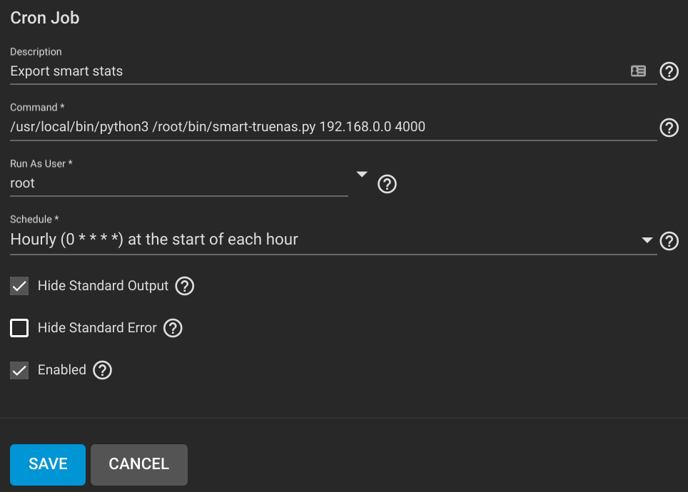

# TrueNAS-smartctl

## Install the script on TrueNAS

Copy `smart-truenas.py` to your TrueNAS server

## Logstash config

Here is the config for logstash. 

```
input {
  tcp {
    port => 4000
    codec => "json"
    ecs_compatibility => "disabled"
  }
}
```

## Run the script 

Once you have logstash setup, run the script 

```
Usage: python3 smart-truenas.py [ip_address] [port]
```

## Setup the crontab on TrueNAS

Create a cron job to export drive stats.



## Troubleshooting

The script relys on smartctl to output json, make sure the below commands work. 

The command to scan for drives.
```
/usr/local/sbin/smartctl -j --scan
```

The command that is run for each drive.
```
/usr/local/sbin/smartctl -j -a [drive]
```

If you get the `Failed to send` errors, check the logstash config.

```
Failed to send : /dev/da0
Failed to send : /dev/da1
Failed to send : /dev/da2
Failed to send : /dev/da3
```
